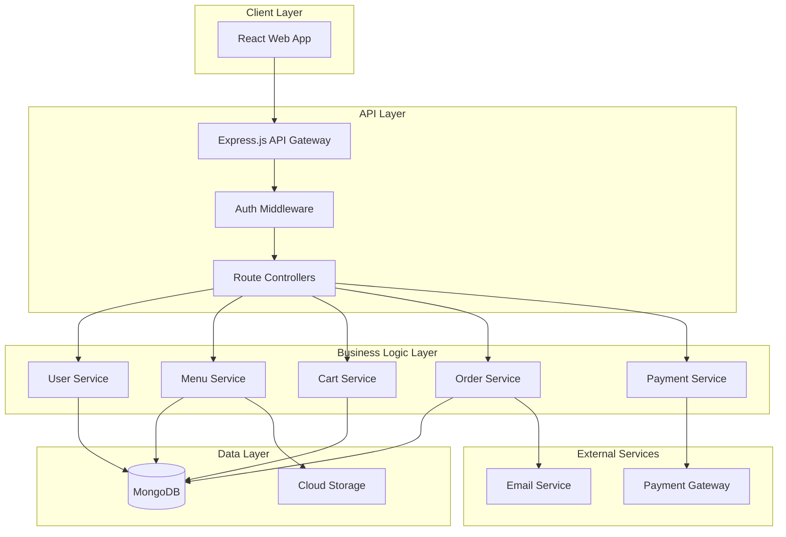
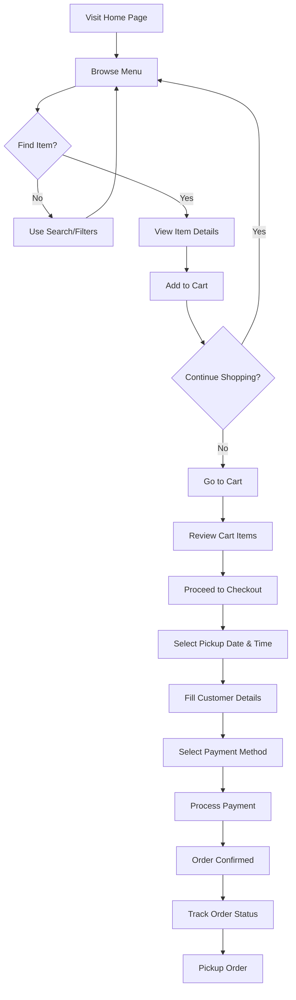
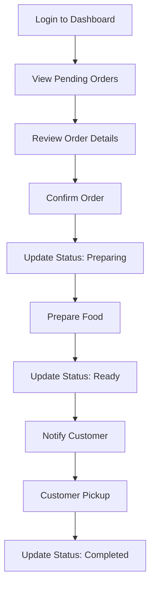

# Home Food Vendor Application - Complete Design & Implementation Guide

> **Project Type:** MERN Stack Web Application  
> **Purpose:** Online food ordering platform for small home food vendors with pickup-based ordering (no delivery)  
> **Last Updated:** December 17, 2025

---

## Table of Contents

1. [Project Overview](#1-project-overview)
2. [System Architecture](#2-system-architecture)
3. [Database Schema Design](#3-database-schema-design)
4. [API Design](#4-api-design)
5. [Frontend Architecture](#5-frontend-architecture)
6. [User Flows](#6-user-flows)
7. [Technical Implementation Details](#7-technical-implementation-details)
8. [Features Breakdown](#8-features-breakdown)
9. [Third-Party Integrations](#9-third-party-integrations)
10. [Development Timeline](#10-development-timeline)
11. [Deployment Strategy](#11-deployment-strategy)
12. [Testing Strategy](#12-testing-strategy)
13. [Design Guidelines](#13-design-guidelines)
14. [Step-by-Step Implementation Process](#14-step-by-step-implementation-process)
15. [Requirements & Prerequisites](#15-requirements--prerequisites)

---

## 1. Project Overview

### 1.1 Purpose

A web application for small home food vendors to manage their food business with online ordering, cart management, payment processing, and pickup scheduling - similar to Swiggy/Zomato but **without home delivery**.

### 1.2 Key Features

- ✅ **User Authentication** - Register, login, profile management
- ✅ **Menu Browsing** - View available food items with images, descriptions, and prices
- ✅ **Shopping Cart** - Add/remove items, modify quantities
- ✅ **Pickup Scheduling** - Select desired date and time for pickup
- ✅ **Payment Integration** - Secure online payment processing
- ✅ **Order Management** - Track order status and history
- ✅ **Vendor Dashboard** - Manage menu items, view orders, update availability

### 1.3 Technology Stack (MERN)

| Layer                | Technology                                    |
| -------------------- | --------------------------------------------- |
| **Frontend**         | React.js with Redux Toolkit                   |
| **Backend**          | Node.js with Express.js                       |
| **Database**         | MongoDB with Mongoose ODM                     |
| **Authentication**   | JWT (JSON Web Tokens)                         |
| **Payment**          | Razorpay (India) / Stripe (Global)            |
| **Image Storage**    | Cloudinary or AWS S3                          |
| **State Management** | Redux Toolkit or Context API                  |
| **Styling**          | CSS Modules / Styled Components / Material-UI |

---

## 2. System Architecture

### 2.1 High-Level Architecture



### 2.2 Component Interaction Flow

1. **User Authentication Flow**: User → React App → Express Auth API → JWT Generation → MongoDB Validation
2. **Menu Browsing Flow**: User → React App → Express Menu API → MongoDB → Return Menu Items
3. **Cart Management Flow**: User → React App → Redux/Context State → Express Cart API → MongoDB
4. **Order Placement Flow**: User → React App → Express Order API → Payment Gateway → MongoDB → Email Notification
5. **Vendor Management Flow**: Vendor → React Dashboard → Express Admin API → MongoDB

---

## 3. Database Schema Design

### 3.1 Users Collection

```javascript
{
  _id: ObjectId,
  name: String,
  email: String,           // Unique, indexed
  password: String,        // Hashed with bcrypt
  phone: String,
  role: String,            // 'customer' | 'vendor' | 'admin'
  address: {
    street: String,
    city: String,
    state: String,
    zipCode: String
  },
  createdAt: Date,
  updatedAt: Date,
  isActive: Boolean,
  emailVerified: Boolean
}
```

### 3.2 Menu Items Collection

```javascript
{
  _id: ObjectId,
  vendorId: ObjectId,      // Reference to Users collection
  name: String,
  description: String,
  category: String,        // 'breakfast', 'lunch', 'dinner', 'snacks', 'desserts'
  price: Number,
  images: [String],        // Array of image URLs
  dietaryInfo: {
    isVegetarian: Boolean,
    isVegan: Boolean,
    isGlutenFree: Boolean,
    spiceLevel: String     // 'mild', 'medium', 'hot'
  },
  ingredients: [String],
  allergens: [String],
  preparationTime: Number, // in minutes
  availableQuantity: Number,
  isAvailable: Boolean,
  createdAt: Date,
  updatedAt: Date,
  ratings: {
    average: Number,
    count: Number
  }
}
```

### 3.3 Cart Collection

```javascript
{
  _id: ObjectId,
  userId: ObjectId,        // Reference to Users collection
  items: [{
    menuItemId: ObjectId,  // Reference to MenuItems collection
    name: String,          // Denormalized for quick access
    price: Number,         // Saved at time of adding
    quantity: Number,
    image: String,
    subtotal: Number       // price * quantity
  }],
  totalAmount: Number,
  createdAt: Date,
  updatedAt: Date
}
```

### 3.4 Orders Collection

```javascript
{
  _id: ObjectId,
  orderNumber: String,     // Auto-generated unique order ID
  userId: ObjectId,        // Reference to Users collection
  vendorId: ObjectId,      // Reference to Users collection
  items: [{
    menuItemId: ObjectId,
    name: String,
    price: Number,
    quantity: Number,
    subtotal: Number
  }],
  pricing: {
    subtotal: Number,
    tax: Number,
    packagingFee: Number,
    total: Number
  },
  pickupDetails: {
    date: Date,            // Scheduled pickup date
    timeSlot: String,      // e.g., '10:00 AM - 11:00 AM'
    customerName: String,
    customerPhone: String,
    specialInstructions: String
  },
  paymentDetails: {
    method: String,        // 'online', 'cash'
    status: String,        // 'pending', 'completed', 'failed', 'refunded'
    transactionId: String,
    paidAt: Date
  },
  status: String,          // 'pending', 'confirmed', 'preparing', 'ready', 'completed', 'cancelled'
  statusHistory: [{
    status: String,
    timestamp: Date,
    note: String
  }],
  createdAt: Date,
  updatedAt: Date
}
```

### 3.5 Reviews Collection

```javascript
{
  _id: ObjectId,
  orderId: ObjectId,       // Reference to Orders collection
  userId: ObjectId,        // Reference to Users collection
  menuItemId: ObjectId,    // Reference to MenuItems collection
  rating: Number,          // 1-5
  comment: String,
  images: [String],
  createdAt: Date,
  vendorResponse: {
    message: String,
    respondedAt: Date
  }
}
```

### 3.6 VendorSettings Collection

```javascript
{
  _id: ObjectId,
  vendorId: ObjectId,      // Reference to Users collection
  businessName: String,
  description: String,
  logo: String,            // Image URL
  businessHours: [{
    day: String,           // 'monday', 'tuesday', etc.
    isOpen: Boolean,
    openTime: String,      // '09:00'
    closeTime: String      // '21:00'
  }],
  pickupSlots: [{
    startTime: String,     // '10:00'
    endTime: String,       // '11:00'
    maxOrders: Number      // Maximum orders per slot
  }],
  minimumOrderAmount: Number,
  packagingFee: Number,
  taxRate: Number,         // Percentage
  acceptingOrders: Boolean,
  holidays: [Date],        // Dates when vendor is closed
  specialNotice: String,   // Display on menu page
  createdAt: Date,
  updatedAt: Date
}
```

---

## 4. API Design

### 4.1 Authentication APIs

#### POST /api/auth/register

**Request:**

```json
{
  "name": "John Doe",
  "email": "john@example.com",
  "password": "SecurePass123",
  "phone": "+91-9876543210",
  "role": "customer"
}
```

**Response:**

```json
{
  "success": true,
  "message": "User registered successfully",
  "token": "jwt_token_here",
  "user": {
    "id": "user_id",
    "name": "John Doe",
    "email": "john@example.com",
    "role": "customer"
  }
}
```

#### POST /api/auth/login

**Request:**

```json
{
  "email": "john@example.com",
  "password": "SecurePass123"
}
```

**Response:**

```json
{
  "success": true,
  "token": "jwt_token_here",
  "user": {
    "id": "user_id",
    "name": "John Doe",
    "email": "john@example.com",
    "role": "customer"
  }
}
```

#### GET /api/auth/profile

**Headers:** `Authorization: Bearer <token>`
**Response:**

```json
{
  "success": true,
  "user": {
    "id": "user_id",
    "name": "John Doe",
    "email": "john@example.com",
    "phone": "+91-9876543210",
    "address": { ... }
  }
}
```

### 4.2 Menu APIs

#### GET /api/menu

**Query Parameters:** `?category=breakfast&isVegetarian=true&search=pizza`
**Response:**

```json
{
  "success": true,
  "items": [
    {
      "id": "item_id",
      "name": "Margherita Pizza",
      "description": "Classic Italian pizza",
      "category": "lunch",
      "price": 299,
      "images": ["url1", "url2"],
      "dietaryInfo": {
        "isVegetarian": true,
        "spiceLevel": "mild"
      },
      "preparationTime": 30,
      "isAvailable": true,
      "ratings": {
        "average": 4.5,
        "count": 120
      }
    }
  ],
  "totalCount": 45
}
```

#### GET /api/menu/:itemId

#### POST /api/menu (Vendor only)

#### PUT /api/menu/:itemId (Vendor only)

#### DELETE /api/menu/:itemId (Vendor only)

### 4.3 Cart APIs

#### GET /api/cart

#### POST /api/cart/add

#### PUT /api/cart/update

#### DELETE /api/cart/remove/:itemId

#### DELETE /api/cart/clear

### 4.4 Order APIs

#### POST /api/orders/create

**Request:**

```json
{
  "pickupDetails": {
    "date": "2025-12-20",
    "timeSlot": "12:00 PM - 01:00 PM",
    "customerName": "John Doe",
    "customerPhone": "+91-9876543210",
    "specialInstructions": "Extra spicy"
  },
  "paymentMethod": "online"
}
```

#### POST /api/orders/verify-payment

#### GET /api/orders

#### GET /api/orders/:orderId

#### PUT /api/orders/:orderId/status (Vendor only)

#### POST /api/orders/:orderId/cancel

### 4.5 Vendor Dashboard APIs

#### GET /api/vendor/dashboard

#### GET /api/vendor/settings

#### PUT /api/vendor/settings

#### GET /api/vendor/orders

### 4.6 Pickup Slots API

#### GET /api/pickup-slots

**Query:** `?date=2025-12-20`
**Response:**

```json
{
  "success": true,
  "slots": [
    {
      "timeSlot": "10:00 AM - 11:00 AM",
      "available": true,
      "remainingCapacity": 8
    }
  ]
}
```

---

## 5. Frontend Architecture

### 5.1 Page Structure

```
├── Public Pages
│   ├── Home/Landing
│   ├── Menu Listing
│   ├── Menu Item Details
│   ├── Login
│   └── Register
│
├── Customer Pages (Protected)
│   ├── Cart
│   ├── Checkout
│   ├── Order Confirmation
│   ├── My Orders
│   ├── Order Details
│   ├── Profile
│   └── Order Tracking
│
└── Vendor Dashboard (Protected)
    ├── Dashboard Home
    ├── Menu Management
    ├── Orders Management
    ├── Settings
    └── Analytics
```

### 5.2 State Management Structure (Redux Toolkit)

```javascript
store
├── auth (user, token, isAuthenticated)
├── menu (items, filters, loading, selectedItem)
├── cart (items, totalAmount, itemCount)
├── orders (ordersList, currentOrder, loading)
└── vendor (settings, orders, stats)
```

---

## 6. User Flows

### 6.1 Customer Journey: Browse to Order



### 6.2 Vendor Journey: Managing Orders



---

## 7. Technical Implementation Details

### 7.1 Backend Structure

```
backend/
├── src/
│   ├── config/
│   │   ├── database.js
│   │   ├── cloudinary.js
│   │   └── razorpay.js
│   ├── models/
│   │   ├── User.js
│   │   ├── MenuItem.js
│   │   ├── Cart.js
│   │   ├── Order.js
│   │   ├── Review.js
│   │   └── VendorSettings.js
│   ├── controllers/
│   │   ├── authController.js
│   │   ├── menuController.js
│   │   ├── cartController.js
│   │   ├── orderController.js
│   │   └── vendorController.js
│   ├── routes/
│   │   ├── auth.js
│   │   ├── menu.js
│   │   ├── cart.js
│   │   ├── orders.js
│   │   └── vendor.js
│   ├── middleware/
│   │   ├── auth.js
│   │   ├── validateRole.js
│   │   ├── errorHandler.js
│   │   └── uploadImage.js
│   ├── utils/
│   │   ├── emailService.js
│   │   ├── validators.js
│   │   └── helpers.js
│   └── app.js
├── .env
├── package.json
└── server.js
```

### 7.2 Frontend Structure

```
frontend/
├── public/
│   ├── index.html
│   └── assets/
├── src/
│   ├── components/
│   │   ├── common/
│   │   │   ├── Navbar.jsx
│   │   │   ├── Footer.jsx
│   │   │   ├── Loader.jsx
│   │   │   └── ErrorBoundary.jsx
│   │   ├── customer/
│   │   │   ├── MenuCard.jsx
│   │   │   ├── CartItem.jsx
│   │   │   ├── TimeSlotPicker.jsx
│   │   │   └── OrderCard.jsx
│   │   └── vendor/
│   │       ├── DashboardStats.jsx
│   │       ├── OrderManagement.jsx
│   │       └── MenuForm.jsx
│   ├── pages/
│   │   ├── customer/
│   │   │   ├── Home.jsx
│   │   │   ├── Menu.jsx
│   │   │   ├── ItemDetails.jsx
│   │   │   ├── Cart.jsx
│   │   │   ├── Checkout.jsx
│   │   │   └── Orders.jsx
│   │   ├── vendor/
│   │   │   ├── Dashboard.jsx
│   │   │   ├── MenuManagement.jsx
│   │   │   └── Settings.jsx
│   │   └── Auth/
│   │       ├── Login.jsx
│   │       └── Register.jsx
│   ├── redux/
│   │   ├── store.js
│   │   └── slices/
│   │       ├── authSlice.js
│   │       ├── menuSlice.js
│   │       ├── cartSlice.js
│   │       └── orderSlice.js
│   ├── services/
│   │   ├── api.js
│   │   ├── authService.js
│   │   ├── menuService.js
│   │   └── orderService.js
│   ├── hooks/
│   │   ├── useAuth.js
│   │   ├── useCart.js
│   │   └── useOrders.js
│   ├── styles/
│   │   ├── global.css
│   │   └── variables.css
│   ├── App.jsx
│   └── index.js
├── .env
├── package.json
└── vite.config.js
```

### 7.3 Security Considerations

1. **Authentication & Authorization**

   - JWT with short expiration times (1-2 hours)
   - Refresh token mechanism
   - HTTP-only cookies for tokens
   - Role-based access control (RBAC)

2. **Data Validation**

   - Input sanitization with validator.js
   - Mongoose schema validation
   - Request rate limiting
   - SQL injection prevention (via Mongoose)

3. **Payment Security**

   - Never store card details
   - Use Razorpay/Stripe SDK
   - Verify payment signatures server-side
   - HTTPS enforcement

4. **API Security**
   - CORS configuration
   - Helmet.js for HTTP headers
   - Express rate limiter
   - API key authentication for webhooks

---

## 8. Features Breakdown

### 8.1 Phase 1: MVP Features (Essential)

- [ ] User registration and authentication
- [ ] Menu browsing with search and filters
- [ ] Shopping cart functionality
- [ ] Pickup date and time slot selection
- [ ] Online payment integration (Razorpay)
- [ ] Order placement and confirmation
- [ ] Basic order tracking
- [ ] Vendor dashboard for order management
- [ ] Menu item management (CRUD)

### 8.2 Phase 2: Enhanced Features

- [ ] User profile management
- [ ] Order history and reordering
- [ ] Email notifications for order updates
- [ ] SMS notifications
- [ ] Rating and review system
- [ ] Advanced analytics for vendors
- [ ] Business hours and holiday management
- [ ] Inventory management
- [ ] Special offers and discounts

### 8.3 Phase 3: Advanced Features

- [ ] Multi-vendor support
- [ ] Loyalty program
- [ ] Push notifications
- [ ] Progressive Web App (PWA)
- [ ] Advanced reporting and analytics
- [ ] Bulk order management

---

## 9. Third-Party Integrations

### 9.1 Payment Gateway

**Recommended: Razorpay** (India-focused)

- Easy integration
- Multiple payment methods
- Good documentation
- Webhook support for payment status

**Alternative: Stripe** (Global)

### 9.2 Email Service

**Options:**

- SendGrid
- Nodemailer with Gmail
- AWS SES

### 9.3 Image Storage

**Options:**

- Cloudinary (recommended for easy transformations)
- AWS S3
- Firebase Storage

---

## 10. Development Timeline

### Phase 1: Foundation (2-3 weeks)

- Week 1: Database design, backend API setup, authentication
- Week 2: Menu and cart APIs, frontend setup, basic components
- Week 3: Integration, payment gateway, testing

### Phase 2: Core Features (3-4 weeks)

- Week 4: Order management, pickup scheduling
- Week 5: Vendor dashboard, menu management
- Week 6: Order tracking, notifications
- Week 7: Testing, bug fixes, refinements

### Phase 3: Polish & Launch (1-2 weeks)

- Week 8: UI/UX improvements, performance optimization
- Week 9: Final testing, deployment setup
- Week 10: Launch and monitoring

**Total Estimated Time: 8-10 weeks**

---

## 11. Deployment Strategy

### 11.1 Recommended Hosting

**Backend:**

- Render (free tier available)
- Railway
- Heroku
- AWS EC2 (scalable)

**Frontend:**

- Vercel (recommended for React)
- Netlify
- AWS S3 + CloudFront

**Database:**

- MongoDB Atlas (free tier available)

### 11.2 Environment Variables

**Backend (.env):**

```env
NODE_ENV=production
PORT=5000
MONGODB_URI=mongodb+srv://...
JWT_SECRET=your_secret_key
JWT_EXPIRE=2h

RAZORPAY_KEY_ID=your_key
RAZORPAY_KEY_SECRET=your_secret

CLOUDINARY_NAME=your_name
CLOUDINARY_API_KEY=your_key
CLOUDINARY_API_SECRET=your_secret

EMAIL_HOST=smtp.gmail.com
EMAIL_USER=your_email
EMAIL_PASS=your_password

FRONTEND_URL=https://yourapp.com
```

**Frontend (.env):**

```env
REACT_APP_API_URL=https://api.yourapp.com
REACT_APP_RAZORPAY_KEY=your_key
```

---

## 12. Testing Strategy

### 12.1 Backend Testing

- Unit tests with Jest
- API testing with Supertest
- Database mocking
- Integration tests

### 12.2 Frontend Testing

- Component testing with React Testing Library
- E2E testing with Cypress or Playwright
- Visual regression testing

### 12.3 Manual Testing Checklist

- [ ] User registration and login
- [ ] Menu browsing and filtering
- [ ] Add/remove items from cart
- [ ] Checkout process
- [ ] Payment integration
- [ ] Order confirmation
- [ ] Vendor dashboard operations
- [ ] Email notifications
- [ ] Mobile responsiveness

---

## 13. Design Guidelines

### 13.1 Color Scheme

**Primary Colors:**

- Brand: #FF6B35 (Orange - food industry standard)
- Success: #4CAF50
- Warning: #FFC107
- Error: #F44336

**Neutral Colors:**

- Dark: #2D2D2D
- Gray: #757575
- Light Gray: #F5F5F5
- White: #FFFFFF

### 13.2 Typography

- **Headings**: Poppins (Bold, 600)
- **Body**: Inter (Regular, 400)
- **Buttons**: Inter (Medium, 500)

### 13.3 UI Elements

- **Border Radius**: 8px (cards), 4px (buttons)
- **Shadows**: Subtle elevation (0 2px 8px rgba(0,0,0,0.1))
- **Spacing**: 8px base unit (8, 16, 24, 32, 48)

### 13.4 Responsive Breakpoints

- Mobile: < 768px
- Tablet: 768px - 1024px
- Desktop: > 1024px

---

## 14. Step-by-Step Implementation Process

### Step 1: Environment Setup

#### 1.1 Install Required Software

```bash
# Install Node.js (v18+ recommended)
# Download from: https://nodejs.org/

# Verify installation
node --version
npm --version

# Install Git
# Download from: https://git-scm.com/

# Install MongoDB Compass (optional, for local DB visualization)
# Download from: https://www.mongodb.com/products/compass
```

#### 1.2 Setup MongoDB Atlas (Cloud Database)

1. Go to [MongoDB Atlas](https://www.mongodb.com/cloud/atlas)
2. Create a free account
3. Create a new cluster (Free tier M0)
4. Create a database user with username and password
5. Whitelist your IP address (or use 0.0.0.0/0 for development)
6. Get your connection string (connect → drivers → Node.js)
   - Format: `mongodb+srv://<username>:<password>@cluster0.xxxxx.mongodb.net/<dbname>?retryWrites=true&w=majority`

#### 1.3 Setup Cloudinary (Image Storage)

1. Go to [Cloudinary](https://cloudinary.com/)
2. Create a free account
3. From dashboard, note down:
   - Cloud Name
   - API Key
   - API Secret

#### 1.4 Setup Razorpay (Payment Gateway)

1. Go to [Razorpay](https://razorpay.com/)
2. Create an account
3. Complete KYC verification (for production)
4. Get Test API Keys from Dashboard → Settings → API Keys
   - Key ID
   - Key Secret

---

### Step 2: Backend Development

#### 2.1 Initialize Backend Project

```bash
# Create project directory
mkdir home-food-vendor
cd home-food-vendor

# Create backend folder
mkdir backend
cd backend

# Initialize Node.js project
npm init -y
```

#### 2.2 Install Backend Dependencies

```bash
# Core dependencies
npm install express mongoose dotenv cors

# Authentication & Security
npm install bcryptjs jsonwebtoken cookie-parser helmet express-rate-limit

# Validation & Utilities
npm install validator express-validator

# File Upload
npm install multer cloudinary multer-storage-cloudinary

# Payment
npm install razorpay

# Email
npm install nodemailer

# Dev dependencies
npm install --save-dev nodemon
```

#### 2.3 Update package.json Scripts

```json
{
  "scripts": {
    "start": "node src/server.js",
    "dev": "nodemon src/server.js"
  }
}
```

#### 2.4 Create Backend Folder Structure

```bash
# Create folders
mkdir src
cd src
mkdir config models controllers routes middleware utils

# Create main files
touch server.js app.js
touch config/database.js config/cloudinary.js config/razorpay.js
touch middleware/auth.js middleware/errorHandler.js
touch utils/emailService.js
```

#### 2.5 Setup .env File

```bash
# In backend folder root
touch .env
```

Add the following to `.env`:

```env
NODE_ENV=development
PORT=5000
MONGODB_URI=your_mongodb_connection_string
JWT_SECRET=your_super_secret_key_change_this
JWT_EXPIRE=2h

RAZORPAY_KEY_ID=your_razorpay_key_id
RAZORPAY_KEY_SECRET=your_razorpay_key_secret

CLOUDINARY_CLOUD_NAME=your_cloud_name
CLOUDINARY_API_KEY=your_api_key
CLOUDINARY_API_SECRET=your_api_secret

EMAIL_HOST=smtp.gmail.com
EMAIL_PORT=587
EMAIL_USER=your_email@gmail.com
EMAIL_PASS=your_app_specific_password

FRONTEND_URL=http://localhost:3000
```

#### 2.6 Create Database Connection (config/database.js)

```javascript
const mongoose = require("mongoose");

const connectDB = async () => {
  try {
    const conn = await mongoose.connect(process.env.MONGODB_URI, {
      useNewUrlParser: true,
      useUnifiedTopology: true,
    });
    console.log(`MongoDB Connected: ${conn.connection.host}`);
  } catch (error) {
    console.error(`Error: ${error.message}`);
    process.exit(1);
  }
};

module.exports = connectDB;
```

#### 2.7 Create Server Entry Point (src/server.js)

```javascript
const dotenv = require("dotenv");
const app = require("./app");
const connectDB = require("./config/database");

// Load environment variables
dotenv.config();

// Connect to database
connectDB();

const PORT = process.env.PORT || 5000;

app.listen(PORT, () => {
  console.log(`Server running in ${process.env.NODE_ENV} mode on port ${PORT}`);
});
```

#### 2.8 Create Express App (src/app.js)

```javascript
const express = require("express");
const cors = require("cors");
const helmet = require("helmet");
const rateLimit = require("express-rate-limit");
const cookieParser = require("cookie-parser");

const app = express();

// Middleware
app.use(helmet());
app.use(
  cors({
    origin: process.env.FRONTEND_URL,
    credentials: true,
  })
);
app.use(express.json());
app.use(express.urlencoded({ extended: true }));
app.use(cookieParser());

// Rate limiting
const limiter = rateLimit({
  windowMs: 15 * 60 * 1000, // 15 minutes
  max: 100, // limit each IP to 100 requests per windowMs
});
app.use("/api", limiter);

// Routes
app.get("/", (req, res) => {
  res.json({ message: "Home Food Vendor API" });
});

// Error handler
app.use(require("./middleware/errorHandler"));

module.exports = app;
```

#### 2.9 Create Models

Create each model file in `src/models/` folder:

- `User.js` - User model with bcrypt password hashing
- `MenuItem.js` - Menu item model
- `Cart.js` - Shopping cart model
- `Order.js` - Order model
- `VendorSettings.js` - Vendor settings model
- `Review.js` - Review model

#### 2.10 Create Controllers & Routes

Create controllers in `src/controllers/`:

- `authController.js` - Register, login, profile
- `menuController.js` - CRUD operations for menu items
- `cartController.js` - Cart management
- `orderController.js` - Order management
- `vendorController.js` - Vendor dashboard

Create routes in `src/routes/`:

- `auth.js` - Authentication routes
- `menu.js` - Menu routes
- `cart.js` - Cart routes
- `orders.js` - Order routes
- `vendor.js` - Vendor routes

#### 2.11 Test Backend

```bash
# Run backend server
npm run dev

# Server should start on http://localhost:5000
# Test with browser or Postman: http://localhost:5000
```

---

### Step 3: Frontend Development

#### 3.1 Create React App

```bash
# Go back to project root
cd ..

# Create React app with Vite (faster alternative to create-react-app)
npm create vite@latest frontend -- --template react

# OR use create-react-app
npx create-react-app frontend

# Navigate to frontend
cd frontend
```

#### 3.2 Install Frontend Dependencies

```bash
# Core dependencies
npm install react-router-dom axios

# State management
npm install @reduxjs/toolkit react-redux

# UI Components (choose one)
npm install @mui/material @mui/icons-material @emotion/react @emotion/styled
# OR
npm install antd
# OR use plain CSS

# Form handling
npm install react-hook-form yup @hookform/resolvers

# Date picker
npm install react-datepicker

# Payment (Razorpay)
npm install react-razorpay

# Notifications
npm install react-toastify

# Icons
npm install react-icons
```

#### 3.3 Create Frontend Folder Structure

```bash
# In src folder
mkdir components pages redux services hooks styles utils

# Create subfolders
mkdir components/common components/customer components/vendor
mkdir pages/customer pages/vendor pages/Auth
mkdir redux/slices
mkdir services
```

#### 3.4 Setup Environment Variables

```bash
# Create .env file in frontend root
touch .env
```

Add to `.env`:

```env
VITE_API_URL=http://localhost:5000/api
VITE_RAZORPAY_KEY=your_razorpay_key_id
```

#### 3.5 Setup Redux Store

Create `src/redux/store.js`:

```javascript
import { configureStore } from "@reduxjs/toolkit";
import authReducer from "./slices/authSlice";
import menuReducer from "./slices/menuSlice";
import cartReducer from "./slices/cartSlice";
import orderReducer from "./slices/orderSlice";

export const store = configureStore({
  reducer: {
    auth: authReducer,
    menu: menuReducer,
    cart: cartReducer,
    orders: orderReducer,
  },
});
```

#### 3.6 Create API Service

Create `src/services/api.js`:

```javascript
import axios from "axios";

const API = axios.create({
  baseURL: import.meta.env.VITE_API_URL,
  headers: {
    "Content-Type": "application/json",
  },
});

// Add token to requests
API.interceptors.request.use(
  (config) => {
    const token = localStorage.getItem("token");
    if (token) {
      config.headers.Authorization = `Bearer ${token}`;
    }
    return config;
  },
  (error) => Promise.reject(error)
);

export default API;
```

#### 3.7 Setup Routing

Update `src/App.jsx`:

```javascript
import { BrowserRouter, Routes, Route } from "react-router-dom";
import { Provider } from "react-redux";
import { store } from "./redux/store";

// Import pages
import Home from "./pages/customer/Home";
import Menu from "./pages/customer/Menu";
import Login from "./pages/Auth/Login";
import Register from "./pages/Auth/Register";

function App() {
  return (
    <Provider store={store}>
      <BrowserRouter>
        <Routes>
          <Route path="/" element={<Home />} />
          <Route path="/menu" element={<Menu />} />
          <Route path="/login" element={<Login />} />
          <Route path="/register" element={<Register />} />
          {/* Add more routes */}
        </Routes>
      </BrowserRouter>
    </Provider>
  );
}

export default App;
```

#### 3.8 Create Components

Start creating components:

- `Navbar.jsx` - Navigation bar
- `MenuCard.jsx` - Display menu item
- `CartItem.jsx` - Cart item component
- Pages for Home, Menu, Cart, Checkout, etc.

#### 3.9 Run Frontend

```bash
# Start development server
npm run dev

# Frontend should start on http://localhost:5173 (Vite)
# or http://localhost:3000 (create-react-app)
```

---

### Step 4: Integration & Testing

#### 4.1 Connect Frontend to Backend

1. Update API calls in services to point to backend
2. Test authentication flow (register/login)
3. Test menu browsing
4. Test cart functionality
5. Implement order placement

#### 4.2 Integrate Payment Gateway

**Razorpay Integration:**

Backend - Create Razorpay order:

```javascript
const Razorpay = require("razorpay");

const razorpay = new Razorpay({
  key_id: process.env.RAZORPAY_KEY_ID,
  key_secret: process.env.RAZORPAY_KEY_SECRET,
});

// Create order
const options = {
  amount: totalAmount * 100, // amount in paise
  currency: "INR",
  receipt: orderNumber,
};

const razorpayOrder = await razorpay.orders.create(options);
```

Frontend - Process payment:

```javascript
const options = {
  key: import.meta.env.VITE_RAZORPAY_KEY,
  amount: order.total * 100,
  currency: "INR",
  name: "Home Food Vendor",
  description: "Food Order Payment",
  order_id: razorpayOrderId,
  handler: function (response) {
    // Verify payment on backend
    verifyPayment(response);
  },
};

const razorpay = new window.Razorpay(options);
razorpay.open();
```

#### 4.3 Test Complete User Flow

1. Register new user
2. Browse menu items
3. Add items to cart
4. Proceed to checkout
5. Select pickup date and time
6. Process payment
7. Verify order confirmation
8. Check vendor dashboard for new order

---

### Step 5: Deployment

#### 5.1 Deploy Backend (Render)

1. Create account on [Render](https://render.com/)
2. Create new Web Service
3. Connect your GitHub repository
4. Configure:
   - Build Command: `npm install`
   - Start Command: `npm start`
   - Add environment variables from .env
5. Deploy

#### 5.2 Deploy Frontend (Vercel)

1. Create account on [Vercel](https://vercel.com/)
2. Import your GitHub repository
3. Configure:
   - Framework Preset: React (or Vite)
   - Build Command: `npm run build`
   - Output Directory: `dist` (Vite) or `build` (CRA)
   - Add environment variables
4. Deploy

#### 5.3 Update Environment Variables

After deployment:

- Update `FRONTEND_URL` in backend .env to your Vercel URL
- Update `VITE_API_URL` in frontend .env to your Render URL
- Redeploy both applications

---

## 15. Requirements & Prerequisites

### 15.1 Software Requirements

| Software | Version | Purpose                     |
| -------- | ------- | --------------------------- |
| Node.js  | v18+    | JavaScript runtime          |
| npm      | v9+     | Package manager             |
| MongoDB  | v6+     | Database (or MongoDB Atlas) |
| Git      | Latest  | Version control             |
| VS Code  | Latest  | Code editor (recommended)   |

### 15.2 Skills Required

**Essential:**

- JavaScript (ES6+)
- React.js basics
- Node.js & Express.js
- MongoDB & Mongoose
- REST API concepts
- Git basics

**Recommended:**

- Redux/Redux Toolkit
- JWT authentication
- Payment gateway integration
- CSS/UI frameworks

### 15.3 Accounts to Create

1. **MongoDB Atlas** - Free database hosting

   - [https://www.mongodb.com/cloud/atlas](https://www.mongodb.com/cloud/atlas)

2. **Cloudinary** - Free image hosting

   - [https://cloudinary.com/](https://cloudinary.com/)

3. **Razorpay** - Payment gateway (India)

   - [https://razorpay.com/](https://razorpay.com/)
   - Alternative: Stripe (Global) - [https://stripe.com/](https://stripe.com/)

4. **Render** - Backend hosting

   - [https://render.com/](https://render.com/)

5. **Vercel** - Frontend hosting
   - [https://vercel.com/](https://vercel.com/)

### 15.4 Development Tools

**Recommended VS Code Extensions:**

- ESLint
- Prettier
- ES7+ React/Redux/React-Native snippets
- MongoDB for VS Code
- GitLens
- Thunder Client (API testing)

**Browser Extensions:**

- React Developer Tools
- Redux DevTools

---

## Summary

This comprehensive guide provides:

✅ **Complete System Design** - Architecture, database schema, API design  
✅ **Implementation Roadmap** - Step-by-step development process  
✅ **Technical Stack** - MERN with modern tools and libraries  
✅ **Security Best Practices** - Authentication, validation, payment security  
✅ **Deployment Guide** - Production-ready hosting solutions  
✅ **Testing Strategy** - Automated and manual testing approaches

### Key Differentiators:

- 🎯 **Pickup-Based Ordering** - No delivery logistics
- 💳 **Integrated Payments** - Razorpay/Stripe integration
- 📅 **Flexible Scheduling** - Date and time slot selection
- 📊 **Vendor Dashboard** - Complete order and menu management
- 🔒 **Secure & Scalable** - Built with industry best practices

### Next Steps:

1. ✅ Review this design document
2. ⏭️ Set up development environment
3. ⏭️ Create MongoDB Atlas account
4. ⏭️ Initialize backend project
5. ⏭️ Initialize frontend project
6. ⏭️ Start Phase 1 development

---

**Document Version:** 1.0  
**Created:** December 17, 2025  
**Last Updated:** December 17, 2025

For questions or clarifications, refer to the detailed sections above or consult the official documentation of respective technologies.
